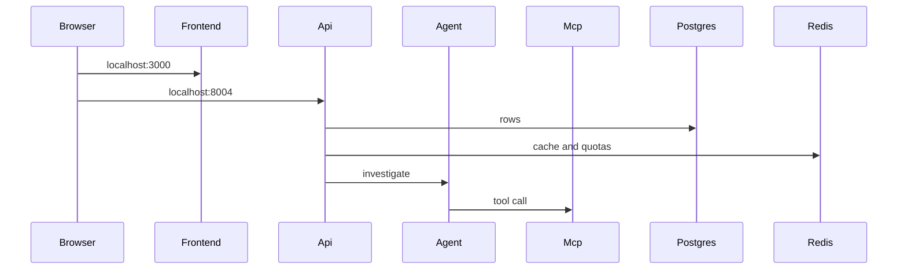

# GitHub Repository Investigator MCP

V0.1 is one read-only MCP server. It clones a public GitHub repository into a workspace and lets a client list directories, read a bounded slice of a file, and search the text. There is no agent, database, or web UI in this version.

The only host tools you need are Docker Engine, the Docker Compose plugin, and a browser.

## Start the server

From this directory:

```bash
docker compose up --build
```

- UI: `http://127.0.0.1:3000` then `/login`
- API health check: `http://127.0.0.1:8004/health`

Optional settings live in [.env.example](.env.example). Compose picks them up if you copy that file to `.env`. A `GITHUB_TOKEN` is optional. Git uses it only as an HTTP header inside the container. Tools never return it, and logs never include it.

## Try the tools

The MCP Inspector runs as a second container. It is not part of the default `docker compose up`.

```bash
docker compose --profile inspect up --build
```

Open `http://127.0.0.1:6274`. If the page asks for a token, copy it from:

```bash
docker compose logs mcp-inspector
```

In the inspector, choose Streamable HTTP and set the server URL to:

```text
http://repository-mcp:8000/mcp
```

That hostname is the Compose service name. The inspector container can resolve it. `127.0.0.1` from inside the inspector container is the inspector itself, not the MCP server.

Then call the tools in this order:

1. `clone_repository` with a public `https://github.com/owner/name` URL. `ref` can be a branch, a tag, or a full 40-character commit SHA. Omit `ref` to use the default branch.
2. `get_repository_info` with the returned `repository_id`.
3. `list_directory` with `path` set to `.`.
4. `search_code` with a word you expect to find.
5. `read_file` with the `path` and `line` from one search hit.

The same URL and ref always map to the same `repository_id`. Calling `clone_repository` again refreshes that workspace.

## How one search_code call moves through the code

1. The inspector sends a tool call to the streamable HTTP app in [mcp-servers/repository-mcp/src/repository_mcp/server.py](mcp-servers/repository-mcp/src/repository_mcp/server.py). That file registers tools, resource templates, and prompts, and adds `GET /health`.
2. [mcp-servers/repository-mcp/src/repository_mcp/tools/search_code.py](mcp-servers/repository-mcp/src/repository_mcp/tools/search_code.py) checks the query and the optional glob.
3. [mcp-servers/repository-mcp/src/repository_mcp/logging.py](mcp-servers/repository-mcp/src/repository_mcp/logging.py) wraps every tool. It writes one JSON log line with the tool name, duration, status, and result count. It does not log arguments.
4. [mcp-servers/repository-mcp/src/repository_mcp/workspace/registry.py](mcp-servers/repository-mcp/src/repository_mcp/workspace/registry.py) loads `/workspaces/registry.json` and finds the workspace for that `repository_id`.
5. [mcp-servers/repository-mcp/src/repository_mcp/workspace/paths.py](mcp-servers/repository-mcp/src/repository_mcp/workspace/paths.py) checks that the workspace stays under `WORKSPACE_ROOT`. Search does not take a user path, but file reads and directory listings use the same jail.
6. [mcp-servers/repository-mcp/src/repository_mcp/search/ripgrep.py](mcp-servers/repository-mcp/src/repository_mcp/search/ripgrep.py) runs `rg` inside the repository, skips `.git`, and stops after the hit limit.

`clone_repository` is the exception to the path jail. It is the tool that creates `/workspaces/<repository_id>` and the registry record. The id comes from [mcp-servers/repository-mcp/src/repository_mcp/workspace/ids.py](mcp-servers/repository-mcp/src/repository_mcp/workspace/ids.py). The git commands live in [mcp-servers/repository-mcp/src/repository_mcp/workspace/clone.py](mcp-servers/repository-mcp/src/repository_mcp/workspace/clone.py).

## Tools

| Tool | Purpose |
| --- | --- |
| `clone_repository` | Shallow-clone a public GitHub repository (depth 50), or refresh an existing one |
| `get_repository_info` | Return the stored URL, owner, name, ref, and commit SHA |
| `list_directory` | List one directory, not its children |
| `read_file` | Read a line range, with size and line caps |
| `search_code` | Search file contents and return path, line, and a short snippet |
| `find_symbol` | Python function, method, and class definitions |
| `find_references` | Import sites and same-file uses of a Python symbol |
| `find_dependencies` | `requirements.txt`, `requirements-*.txt`, and `pyproject.toml` dependencies |
| `detect_project_type` | Languages from file suffixes, and FastAPI, Flask, or Django |
| `detect_services` | Top-level Python packages and obvious entry files |

Errors look like this:

```json
{
  "error": {
    "code": "FILE_NOT_FOUND",
    "message": "src/missing.py was not found",
    "retryable": false,
    "request_id": "req_123"
  }
}
```

Codes in this version: `INVALID_REPOSITORY_URL`, `REPOSITORY_NOT_FOUND`, `CLONE_FAILED`, `INVALID_PATH`, `FILE_NOT_FOUND`, `FILE_TOO_LARGE`, `TOOL_TIMEOUT`, `GITHUB_RATE_LIMIT`, `INTERNAL_ERROR`, `SYMBOL_NOT_FOUND`, `UNSUPPORTED_LANGUAGE`, `GIT_REF_NOT_FOUND`, `ANALYSIS_TIMEOUT`, `UNAUTHORIZED`, `QUOTA_EXCEEDED`.

## Limits

| Variable | Default |
| --- | --- |
| `MAX_READ_LINES` | 200 |
| `MAX_FILE_BYTES` | 1048576 |
| `MAX_SEARCH_HITS` | 50 |
| `MAX_DIRECTORY_ENTRIES` | 200 |
| `CLONE_TIMEOUT_SECONDS` | 60 |
| `TOOL_TIMEOUT_SECONDS` | 30 |
| `MAX_PYTHON_FILES` | 200 |
| `MAX_SYMBOLS` | 500 |
| `MAX_REFERENCES` | 50 |
| `INDEX_TIMEOUT_SECONDS` | 30 |
| `GIT_CLONE_DEPTH` | 50 |
| `DEFAULT_PAGE_SIZE` | 20 |
| `MAX_PAGE_SIZE` | 50 |
| `MAX_DIFF_LINES` | 200 |
| `MAX_BRANCHES` | 50 |
| `ANALYSIS_TIMEOUT` | 30 |
| `MAX_FUNCTIONS` | 500 |
| `MAX_CLASSES` | 500 |
| `MAX_ENDPOINTS` | 200 |
| `MAX_EDGES` | 500 |
| `MAX_HINTS` | 200 |
| `MAX_STEPS` | 8 |
| `MAX_TOOL_CALLS` | 12 |
| `MAX_TOOL_OUTPUT_CHARS` | 4000 |
| `AGENT_TIMEOUT_SECONDS` | 60 |
| `MAX_RETRIES` | 2 |
| `RESOURCE_MAX_CHARS` | 8000 |
| `IMPORTS_PER_MINUTE` | 10 |
| `ANALYSES_PER_MINUTE` | 5 |
| `WORKSPACE_TTL_SECONDS` | 604800 |
| `CACHE_TTL_SECONDS` | 3600 |
| `MAX_FILE_ROWS` | 2000 |
| `ALICE_TOKEN` | alice-local-token |
| `BOB_TOKEN` | bob-local-token |
| `MAX_CONCURRENT_IMPORTS` | 2 |
| `MAX_ANALYSIS_JOBS` | 3 |
| `MAX_BODY_BYTES` | 1000000 |

A file larger than `MAX_FILE_BYTES` is refused with `FILE_TOO_LARGE`. A read that asks for more than `MAX_READ_LINES` returns the first allowed lines and `"truncated": true`.

## How find_symbol moves through the code

V0.2 adds Python structure on the same server. Browse and search from V0.1 are unchanged.

1. `find_symbol` is registered in [mcp-servers/repository-mcp/src/repository_mcp/server.py](mcp-servers/repository-mcp/src/repository_mcp/server.py).
2. [mcp-servers/repository-mcp/src/repository_mcp/tools/find_symbol.py](mcp-servers/repository-mcp/src/repository_mcp/tools/find_symbol.py) asks for the index, then filters definitions by name. No definitions is `SYMBOL_NOT_FOUND`.
3. [mcp-servers/repository-mcp/src/repository_mcp/intelligence/index.py](mcp-servers/repository-mcp/src/repository_mcp/intelligence/index.py) loads `/workspaces/<repository_id>.index.json` when the commit SHA and analyzer version match. Otherwise it rebuilds that file beside the clone, not inside the git checkout.
4. [mcp-servers/repository-mcp/src/repository_mcp/intelligence/python_index.py](mcp-servers/repository-mcp/src/repository_mcp/intelligence/python_index.py) parses Python with the standard-library `ast` module. It records functions, async functions, classes, and methods. A syntax error becomes a warning and does not fail the tool.

`find_references` does not follow aliases. A reference is a use of the exact name in a file that defines it, or an import line that names it. `import create_user as make_user` counts that import line. Later uses of `make_user` do not.

`find_symbol` on repository-mcp still indexes Python with `ast`. A non-Python file there is a warning. analysis-mcp parses JavaScript, TypeScript, and Java with Tree-sitter and leaves Go as that same kind of warning. `search_symbols` on analysis-mcp embeds the symbol line with MiniLM and reads the nearest rows from Postgres.

## How get_file_history moves through the code

V0.3 adds a second MCP server, `git-mcp`, on port 8001. It answers history questions. It does not clone, and it does not return file contents. `read_file` stays on port 8000.

1. `get_file_history` is registered in [mcp-servers/git-mcp/src/git_mcp/server.py](mcp-servers/git-mcp/src/git_mcp/server.py). That file registers the eight read-only git tools and the `investigate_change` prompt, and adds `GET /health`.
2. [mcp-servers/git-mcp/src/git_mcp/tools/get_file_history.py](mcp-servers/git-mcp/src/git_mcp/tools/get_file_history.py) checks the page size, then asks for the commits that touched one path.
3. [mcp-servers/git-mcp/src/git_mcp/git/commands.py](mcp-servers/git-mcp/src/git_mcp/git/commands.py) is the only place git runs. Every command is an argument list with `GIT_OPTIONAL_LOCKS=0`, so a read-only `.git` does not take a lock. Commit, push, checkout, reset, merge, rebase, and clean are not tools.
4. [shared/investigator_shared/registry.py](shared/investigator_shared/registry.py) reads `/workspaces/registry.json`, the same file Repository MCP writes. [shared/investigator_shared/paths.py](shared/investigator_shared/paths.py) keeps the requested path inside that workspace.

The patch is a separate `get_diff` call. `get_diff` includes both resolved SHAs and cuts the patch at `MAX_DIFF_LINES`. Point the inspector at `http://git-mcp:8001/mcp` to call these tools. The `workspaces` volume is mounted read-only on `git-mcp`.

## How detect_api_endpoints moves through the code

V0.4 adds a third MCP server, `analysis-mcp`, on port 8002. It re-parses Python with the standard-library `ast` module. It does not read the V0.2 index, and it does not import the other servers.

1. `detect_api_endpoints` is registered in [mcp-servers/analysis-mcp/src/analysis_mcp/server.py](mcp-servers/analysis-mcp/src/analysis_mcp/server.py). That file registers the nine analysis tools, the architecture resources, and the analysis prompts, and adds `GET /health`.
2. [mcp-servers/analysis-mcp/src/analysis_mcp/tools/detect_api_endpoints.py](mcp-servers/analysis-mcp/src/analysis_mcp/tools/detect_api_endpoints.py) loads the analysis artifact and returns the endpoint list.
3. [mcp-servers/analysis-mcp/src/analysis_mcp/analysis/endpoints.py](mcp-servers/analysis-mcp/src/analysis_mcp/analysis/endpoints.py) reads FastAPI and Flask decorators, Django `path` / `re_path` calls in `urls.py`, and `@api_view`. The route path is a string literal.
4. [mcp-servers/analysis-mcp/src/analysis_mcp/analysis/artifact.py](mcp-servers/analysis-mcp/src/analysis_mcp/analysis/artifact.py) writes `/workspaces/<repository_id>.analysis.json` beside the clone when the commit SHA or analyzer version changed. The git checkout is not modified. [shared/investigator_shared/registry.py](shared/investigator_shared/registry.py) reads the same registry Repository MCP writes.

`analyze_code` returns counts and warnings. Functions, the graph, database hints, and HTTP client calls stay on their own tools. A call edge has `inferred: true` because the name matched one function. That is not a runtime trace. A file that fails to parse adds a warning and the rest of the run continues. `ANALYSIS_TIMEOUT` is retryable.

File contents stay on port 8000. History stays on port 8001. This server does not summarize the graph with a model. Point the inspector at `http://analysis-mcp:8002/mcp` to call these tools.

## How one investigation moves through the code

V0.5 adds an `agent` service on port 8003. It is an MCP client. It does not import the other servers, and it does not mount the workspace volume.

1. `POST /investigate` is handled in [agent/src/agent_app/server.py](agent/src/agent_app/server.py). The body has a question and either a `repository_id` or a GitHub `url`. A URL calls `clone_repository` on repository-mcp before the loop starts. `GET /health` stays ok when `OPENAI_API_KEY` is missing. The investigation then returns `stopped_reason` `configuration`.
2. [agent/src/agent_app/graph.py](agent/src/agent_app/graph.py) is a LangGraph loop: one model turn, then every tool call from that turn together, then the model again. The next turn waits for the whole batch. The loop stops at `MAX_STEPS`, `MAX_TOOL_CALLS`, or `AGENT_TIMEOUT_SECONDS`. A failed tool is retried only when `retryable` is true, at most `MAX_RETRIES` times.
3. [agent/src/agent_app/policy.py](agent/src/agent_app/policy.py) is the system text: search before reading a large file, anchor facts to the commit SHA, and do not invent tool results.
4. [agent/src/agent_app/mcp_client.py](agent/src/agent_app/mcp_client.py) is the only place that calls MCP over HTTP. The servers are `http://repository-mcp:8000/mcp`, `http://git-mcp:8001/mcp`, and `http://analysis-mcp:8002/mcp`.

The response includes `answer`, `evidence`, `trace`, and `stopped_reason`. Evidence with `confidence` `high` came from a tool result that included the file and line. The trace stores the server, tool, status, duration, and an argument summary. It does not store file bodies or the API key. The trace is kept in memory for the life of the process.

## How a file resource and a prompt move through the code

V0.6 adds read-only JSON resources and reusable prompts. A resource is one document for the commit already stored. A prompt is instructions that name tools. The prompt starts the investigation loop. It is not an answer.

1. A client reads `repo://{id}/file/{path}`, for example `repo://repo_abc/file/app/main.py`. [mcp-servers/repository-mcp/src/repository_mcp/server.py](mcp-servers/repository-mcp/src/repository_mcp/server.py) registers that template. The path is the remainder of the URI, so slashes inside the file path stay intact.
2. [mcp-servers/repository-mcp/src/repository_mcp/resources.py](mcp-servers/repository-mcp/src/repository_mcp/resources.py) keeps the path inside the checkout with the same rules as `read_file`. `..`, an absolute path, and `.git` return `INVALID_PATH`. An unknown `repository_id` returns `REPOSITORY_NOT_FOUND` in the JSON body.
3. [shared/investigator_shared/secrets.py](shared/investigator_shared/secrets.py) redacts the file text before it is returned. A line whose name ends with `_KEY`, `_TOKEN`, or `_SECRET` loses its value. A PEM private-key block is removed. `GITHUB_TOKEN` is never copied into a resource. [shared/investigator_shared/bounds.py](shared/investigator_shared/bounds.py) caps the JSON at `RESOURCE_MAX_CHARS`.
4. `trace_api` is registered in [mcp-servers/analysis-mcp/src/analysis_mcp/prompts.py](mcp-servers/analysis-mcp/src/analysis_mcp/prompts.py). Its text names `search_symbols`, then `search_code`, `find_symbol`, `read_file`, `find_references`, and `detect_database_access`. The endpoint path is an argument.
5. `POST /investigate` can send `prompt` and `arguments`. [agent/src/agent_app/server.py](agent/src/agent_app/server.py) asks [agent/src/agent_app/prompts.py](agent/src/agent_app/prompts.py) to load that prompt. [agent/src/agent_app/mcp_client.py](agent/src/agent_app/mcp_client.py) calls `get_prompt` on the server that lists the name. The returned text becomes the question for the existing loop. An unknown name returns an answer that the prompt was not found and an empty trace.

Metadata, structure, and dependencies stay on repository-mcp. Architecture and endpoints stay on analysis-mcp. git-mcp has `investigate_change` and no resources.

## How an import is stored

V0.7 adds `postgres`, `redis`, and `api` on port 8004. Postgres and Redis are not published to the host. MCP tools still read the workspace volume. They do not open Redis.

1. `POST /repositories` is handled in [apps/api/src/api_app/routes/repositories.py](apps/api/src/api_app/routes/repositories.py). An `Idempotency-Key` header returns the original job. The route enqueues work and returns.
2. [apps/api/src/api_app/jobs.py](apps/api/src/api_app/jobs.py) calls `clone_repository`. The MCP servers allow the Compose host names in the `Host` header so that call is accepted. [mcp-servers/repository-mcp/src/repository_mcp/workspace/registry.py](mcp-servers/repository-mcp/src/repository_mcp/workspace/registry.py) upserts the `repositories` row when `DATABASE_URL` is set. The columns are created by [apps/api/migrations/001_tables.sql](apps/api/migrations/001_tables.sql), applied by the API before it listens.
3. The same job records file paths, symbols, and dependencies. File text stays on the `workspaces` volume.
4. A second `POST /repositories/{id}/analyze` for the same commit is handled in [apps/api/src/api_app/cache.py](apps/api/src/api_app/cache.py). A hit logs `cache_hit` and does not call the analyzer again. The stored architecture matches the first run.

`POST /investigations` enqueues a job and returns immediately. The job calls the existing agent loop and stores the answer, the evidence, and the trace. A prompt or a question still starts that loop. The API only stores the result. `GET /repositories/{id}/architecture` reads the stored artifact and does not start analysis.

```bash
docker compose --profile test-api run --rm api-tests
```

Set `ALLOW_LOCAL_GIT=1` and `AGENT_TEST_MODEL=scripted` for that command so the fixture import and the scripted investigation can run. `IMPORTS_PER_MINUTE=2` makes the rate-limit test finish on the third import.

## How a page reads evidence

V0.8 adds `frontend` on port 3000. Open `http://localhost:3000`. The browser calls the API on port 8004. It does not call an MCP server.

1. The import form in [apps/frontend/src/screens/Home.tsx](apps/frontend/src/screens/Home.tsx) uses [apps/frontend/src/api.ts](apps/frontend/src/api.ts). That module posts to `POST /repositories` and polls the job until the repository is ready.
2. [apps/api/src/api_app/jobs.py](apps/api/src/api_app/jobs.py) still clones and stores the rows. The overview reads those rows. It does not start analysis.
3. An evidence link calls `GET /repositories/{id}/file`. That route calls the existing `read_file` tool, so the path rules and secret redaction stay on repository-mcp.
4. A prompt button posts `POST /investigations`. The job runs the agent loop. The assistant message keeps the evidence, and the trace keeps the argument summary. Refreshing the chat URL reads that session back from Postgres.

```bash
ALLOW_LOCAL_GIT=1 AGENT_TEST_MODEL=scripted docker compose --profile test-frontend run --rm frontend-tests
```

## Tests

Tests run inside the image. Nothing is installed on the host.

```bash
docker compose --profile test run --rm tests
docker compose --profile test-git run --rm git-tests
docker compose --profile test-analysis run --rm analysis-tests
docker compose --profile test-agent run --rm agent-tests
ALLOW_LOCAL_GIT=1 AGENT_TEST_MODEL=scripted docker compose --profile test-api run --rm api-tests
ALLOW_LOCAL_GIT=1 AGENT_TEST_MODEL=scripted docker compose --profile test-frontend run --rm frontend-tests
```

Repository tests cover browse, search, and Python structure. Git tests use a three-commit fixture and do not contact GitHub. Analysis tests use a small FastAPI fixture with a database hint, an HTTP client call, and one file that does not parse. Agent tests use a scripted model and an in-process MCP stub, so they do not call OpenAI. API tests import a local fixture through the running stack, then read the stored architecture and trace from Postgres. The running repository server does not set `ALLOW_LOCAL_GIT`, so a non-GitHub URL is rejected.

After the MCP servers, the agent, the API, and the frontend are up, the health smoke test calls them over the Compose network:

```bash
docker compose --profile smoke run --rm smoke
```

## How a login reaches a repository

V0.9 adds two local bearer tokens. The database stores the caller id `alice` or `bob`. It does not store the token.

1. [apps/frontend/src/screens/Login.tsx](apps/frontend/src/screens/Login.tsx) keeps the token in memory and [apps/frontend/src/api.ts](apps/frontend/src/api.ts) sends `Authorization: Bearer` on each call. A refresh drops the token and returns to `/login`.
2. [apps/api/src/api_app/auth.py](apps/api/src/api_app/auth.py) maps `ALICE_TOKEN` and `BOB_TOKEN` to caller ids. A missing or unknown token is `401` with `UNAUTHORIZED`. `GET /me` returns the caller id.
3. `POST /repositories` writes a `repository_access` row for that caller. List, overview, file, jobs, architecture, and investigations require that row. Someone else gets `404` with `REPOSITORY_NOT_FOUND`.
4. A cited file goes through `GET /repositories/{id}/file`. The route rejects an absolute path, `..`, and `.git` with `INVALID_PATH`. `read_file` then redacts secrets with [shared/investigator_shared/secrets.py](shared/investigator_shared/secrets.py). The same function redacts log lines.
5. The agent hashes the raw tool arguments in [agent/src/agent_app/trace.py](agent/src/agent_app/trace.py). The trace returns `argument_hash` and the short identifier summary. The raw argument map is not stored.

The same request path covers traversal, huge files, malicious filenames, secret leakage, tool-argument injection, and expensive analysis. Concurrent imports stop at `MAX_CONCURRENT_IMPORTS` with `QUOTA_EXCEEDED`. A repository keeps at most `MAX_ANALYSIS_JOBS` analysis jobs. A body over `MAX_BODY_BYTES` is refused. When the agent stops because `MAX_TOOL_CALLS` was reached, the investigation job is `QUOTA_EXCEEDED`.

The host browser reaches the UI on port 3000 and the API on port 8004. The MCP servers and the agent stay on the Compose network. The Inspector still uses `http://repository-mcp:8000/mcp`.

## How the running stack fits together

V1.0 does not add a tool. It makes the V0.9 path observable. The host publishes the UI on port 3000 and the API on port 8004. MCP and the agent stay on the Compose network.



Each process exposes `GET /metrics` as JSON: counters and histograms (`count`, `sum_ms`, `max_ms`, and buckets under 100 ms, under 1 s, and the rest). A restart clears the numbers. There is no Prometheus container and no metrics page. `GET /metrics` is open, like `/health`. Log lines are `key=value` text from `log_event` in [shared/investigator_shared/secrets.py](shared/investigator_shared/secrets.py). A line can carry `event`, `duration_ms`, `status`, `request_id`, `session_id`, and `repository_id`. It does not carry a token or raw tool arguments.

## Frozen catalog

These names and argument names are the V1.0 contract. The registration tests fail if a live tool drifts. A later break needs a version note in this file.

repository-mcp tools: `clone_repository` (`repository_url`, `ref`), `get_repository_info` (`repository_id`), `list_directory` (`repository_id`, `path`), `read_file` (`repository_id`, `path`, `start_line`, `end_line`), `search_code` (`repository_id`, `query`, `file_pattern`), `find_symbol` (`repository_id`, `symbol`), `find_references` (`repository_id`, `symbol`), `find_dependencies` (`repository_id`), `detect_project_type` (`repository_id`), `detect_services` (`repository_id`).

repository-mcp resources: `repo://{repository_id}/metadata`, `structure`, `dependencies`, and `file/{file_path}`. Prompts: `explain_repository` (`repository_id`), `onboard_developer` (`repository_id`), `explain_symbol` (`repository_id`, `symbol`).

git-mcp tools: `get_git_status` (`repository_id`), `get_branches` (`repository_id`), `get_commits` (`repository_id`, `ref`, `page`, `page_size`), `get_commit` (`repository_id`, `ref`), `get_diff` (`repository_id`, `base`, `head`), `get_file_history` (`repository_id`, `path`, `ref`, `page`, `page_size`), `compare_branches` (`repository_id`, `base`, `head`), `find_introduced_change` (`repository_id`, `path`, `line`). Prompt: `investigate_change` (`repository_id`, `path`).

analysis-mcp tools: `analyze_code` (`repository_id`), `find_functions` (`repository_id`, `name`, `page`, `page_size`), `find_classes` (`repository_id`, `name`, `page`, `page_size`), `find_imports` (`repository_id`, `name`, `page`, `page_size`), `build_dependency_graph` (`repository_id`), `detect_entrypoints` (`repository_id`), `detect_api_endpoints` (`repository_id`), `detect_database_access` (`repository_id`), `detect_external_services` (`repository_id`), `search_symbols` (`repository_id`, `query`). Resources: `repo://{repository_id}/architecture` and `repo://{repository_id}/analysis/endpoints`. Prompts: `review_architecture` (`repository_id`), `trace_api` (`repository_id`, `endpoint`).

workspace-mcp tools, registered only when `WRITE_ENABLED=1`: `propose_patch` (`repository_id`, `diff`, `session_id`), `preview_patch` (`proposal_id`), `apply_patch` (`proposal_id`, `approval_id`). The agent fills `session_id`. The model does not choose it. A default `docker compose up` leaves `WRITE_ENABLED` at `0`, so these three tools are absent.

Error codes: `INVALID_REPOSITORY_URL`, `REPOSITORY_NOT_FOUND`, `CLONE_FAILED`, `INVALID_PATH`, `FILE_NOT_FOUND`, `FILE_TOO_LARGE`, `TOOL_TIMEOUT`, `GITHUB_RATE_LIMIT`, `INTERNAL_ERROR`, `SYMBOL_NOT_FOUND`, `UNSUPPORTED_LANGUAGE`, `GIT_REF_NOT_FOUND`, `ANALYSIS_TIMEOUT`, `UNAUTHORIZED`, `QUOTA_EXCEEDED`, `RATE_LIMITED`.

## Demo script

Sign in at `http://localhost:3000/login` with `alice-local-token`. Then:

1. Import `file:///fixtures/service_app` and wait until the overview shows a commit.
2. Open the overview and read languages, dependencies, and analysis status. After analysis has finished, search for a symbol and open the cited line.
3. Run `explain_repository`. Open the trace and confirm a row names a server and a tool, and does not contain the file body.
4. Open the first "Found in" link and read the cited lines.
5. Open architecture and click a node.
6. Open jobs.
7. Request the file path `../../etc/passwd`. The API returns `INVALID_PATH`.
8. A second caller with `bob-local-token` gets `REPOSITORY_NOT_FOUND` for Alice's repository and for Alice's trace.
9. With `WRITE_ENABLED=1`, ask `Add the comment reviewed to app/main.py`. Approve the diff in the chat, then Apply. Open `app/main.py` and read `# reviewed` on the first line. The default stack skips this step because the write tools are not registered.

The last step is manual and needs a network: import `https://github.com/pallets/flask` at the default branch. Skip it when GitHub is unreachable. Automated tests stay on `file://` fixtures.

To call an MCP tool by name, use the Inspector profile. The server URL inside that container is `http://repository-mcp:8000/mcp`.

## Known limitations

Git tools stay read-only. There is no commit, push, or pull request. There is no SSO or OAuth. `WRITE_ENABLED` defaults to `0`, so a normal `docker compose up` does not register `propose_patch`, `preview_patch`, or `apply_patch`. With the flag on, the owner approves a diff in the chat and the approval lasts 10 minutes. Metrics reset when a process restarts. This stack does not run Prometheus or Grafana. Go files are listed as a warning and are not parsed. Symbol search uses a MiniLM model baked into the analysis image at build time. The running container does not download that model. Call edges are name matches in the parsed files, so a dynamic call can be missed.

## Version note

V1.2 adds `propose_patch`, `preview_patch`, and `apply_patch` on workspace-mcp. They are registered only when `WRITE_ENABLED=1`. The default stack does not register them. An approved diff is written in Python after the repository owner clicks Approve. Git stays read-only. V1.1 adds JavaScript, TypeScript, and Java parsing, the `search_symbols` tool, and pgvector symbol search. Analyzer version `0.5.0` replaces `0.4.0`, so a stored analysis for the same commit is rebuilt. Existing tool argument names stay. V1.0 added metrics, key=value logs, the `multi_module` and `nested_read` fixtures, and the demo docs.

## What this version does not do

SSO and OAuth stay later. Go is not parsed. analysis-mcp does not summarize the graph with a model. The agent proposes a diff and does not apply it. git-mcp cannot commit, push, or check out a branch. Kubernetes, a mobile client, and a separate metrics product stay out. See [VERSION_ROADMAP.md](VERSION_ROADMAP.md).

## Logs and shutdown

```bash
docker compose logs -f repository-mcp
docker compose logs -f git-mcp
docker compose logs -f analysis-mcp
docker compose logs -f agent
docker compose logs -f api
docker compose logs -f frontend
docker compose down
```

A log line looks like `event=tool_call duration_ms=12 status=success request_id=req_abc repository_id=repo_123 tool=search_code`. Metrics for one process:

```bash
curl http://127.0.0.1:8004/metrics
```

`docker compose down -v` also deletes cloned workspaces.
